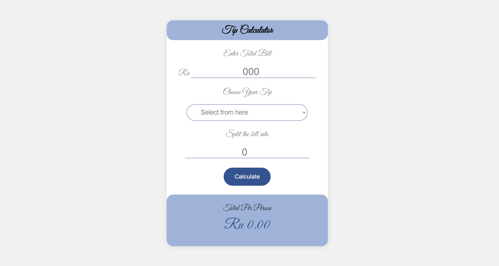

# Tip-Calulator

This is a solution to the Tip Calculator. I do this project to show my coding skill in HTML, CSS and JS. 

## 🚀 About Me
I'm a full stack developer...

## 🛠 Skills
HTML, CSS, Bootstrap, Vanilla Java Script , Java languge, DSA.

## Table of contents

- Overview
   - [The challenge]
   - [Screenshot]
   - [Links]

- My process

- [Author](#authors)

## Screenshots

## Links

-Solution URL: @(https://github.com/pallaviparihar123/Tip-Calulator)

-Live Site URL: @(https://papaya-daifuku-a522a6.netlify.app/)
## Author

- GitHub link - [@PallaviParihar](https://www.github.com/pallaviparihar123)
- Linkedin - [@PallaviParihar](https://www.linkedin.com/in/pallavi-parihar-23bb13200/)

